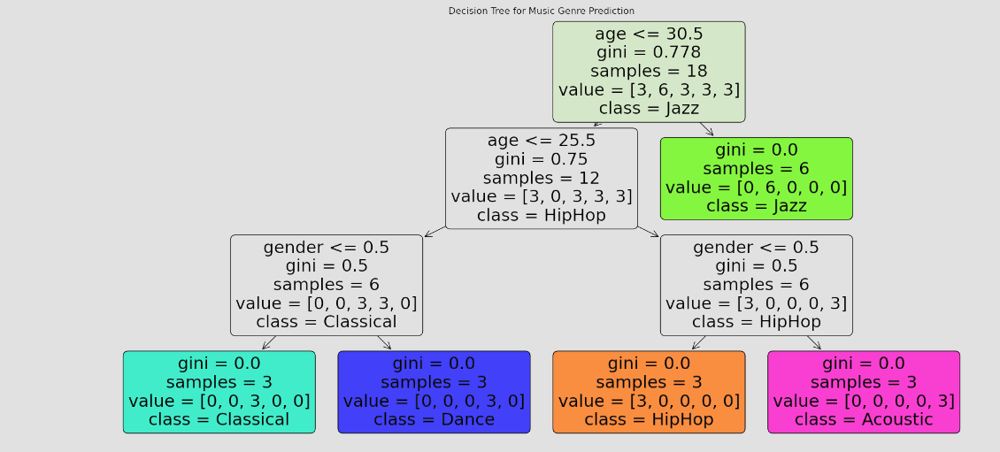

# Music Genre Prediction Project

## Overview

This project, developed by Osamah Amer, utilizes a Decision Tree Classifier to predict music genres based on user features such as age and gender. The implementation is done in Python, leveraging libraries such as Pandas for data manipulation, Scikit-learn for the machine learning model, and Matplotlib for visualization. The analysis and modeling process are demonstrated in a Jupyter Notebook.

## Project Decision Tree Visualization



## Getting Started

### Prerequisites

- Python 3.x
- Pipenv for managing project dependencies

### Installation

1. **Clone the repository**:
   ```
   git clone https://github.com/ProgrammingWithOsku/MusicGenrePredictor.git
   ```

2. **Navigate to the project directory**:
   ```
   cd MusicGenrePredictor
   ```

3. **Install dependencies using Pipenv**:
   ```
   pipenv install
   ```

4. **Activate the virtual environment**:
   ```
   pipenv shell
   ```

5. **Launch Jupyter Notebook to view the project**:
   ```
   jupyter notebook
   ```

## Usage

Open the `Music_Genre_Prediction.ipynb` notebook in Jupyter to view the implementation, from loading and preprocessing the data to training the model and visualizing the decision tree.

## Contributing

Contributions to the project are welcome! Feel free to fork the repository, make changes, and submit pull requests.

## License

This project is licensed under the MIT License - see the [LICENSE](LICENSE) file for details.

## Acknowledgments

- This project was developed by Osamah Amer.
- Repository: [MusicGenrePredictor](https://github.com/ProgrammingWithOsku/MusicGenrePredictor)

